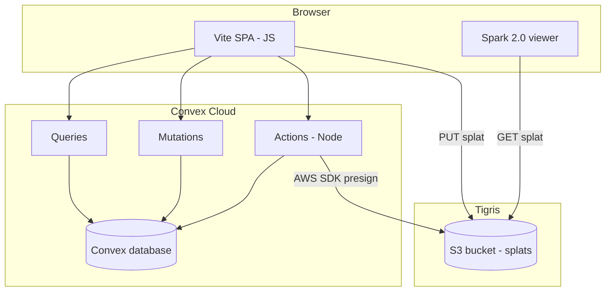

# Sparkler — Architecture

Sparkler is a Gaussian splat hosting and viewing product: users upload splat files, browse a library, and open shareable viewer URLs. Rendering uses **Spark 2.0** from the local [`spark`](../spark/) package (`SparkRenderer`, `SplatMesh`). The control plane and OLTP run on **Convex**. Large binaries live in **Tigris** (S3-compatible object storage); browsers upload and download them directly via presigned URLs.

---

## Goals

- **Upload**: Large files (e.g. `.spz`, `.ply`) without streaming through Convex.
- **View**: Spark 2.0 + Three.js in a Vite-built SPA (JavaScript).
- **Metadata**: Scenes, ownership, visibility, status — queryable and auth-aware.
- **Share**: Stable routes such as `/s/:sceneId` and optional `/embed/:sceneId`.

Non-goals for v1 (can follow later): server-side transcoding, LoD/RAD pipeline in the cloud, multipart uploads, billing.

---

## System context

---

## Technology choices

| Area | Choice | Notes |
|------|--------|--------|
| Frontend | **Vite**, **JavaScript** (ES modules), **React** (recommended with Convex) | Convex’s official client is React-first; plain JS is possible with `ConvexHttpClient` for a thinner stack. |
| Rendering | **Spark 2.0** — [`../spark`](../spark/) | Build Spark first (`npm run build` in `spark`); depend via `"@sparkjsdev/spark": "file:../spark"`. Use **`SparkRenderer`** (pass `renderer: THREE.WebGLRenderer`) and add it to the scene; use **`SplatMesh`** with `url` (and optional `lod: true`, `fileType` when needed). Docs in spark refer to “NewSparkRenderer” in places; the exported class is **`SparkRenderer`**. |
| Backend / OLTP | **Convex** | Schema, queries, mutations, realtime subscriptions, scheduled jobs if needed. |
| Blob storage | **Tigris** | S3 API; credentials and endpoint in Convex environment variables. |
| Auth | **Clerk + Convex** with demo fallback | Clerk is the primary auth path; `SPARKLER_DEMO_OWNER_SUBJECT` supports local no-auth development. |

**Three.js**: Align major version with Spark’s peer expectations (see `spark/package.json` devDependencies, e.g. `three`).

---

## Data flow

### Upload (presigned PUT)

1. **Mutation** `createScene` — Authenticated user inserts a row: `status: "pending_upload"`, `storageKey` (e.g. `splats/{id}.spz`), optional title/visibility.
2. **Action** `presignUpload` — Node runtime; verifies ownership and policy; uses `@aws-sdk/client-s3` + presigner against Tigris endpoint; returns short-lived **PUT** URL + required headers.
3. **Browser** — `fetch(presignedUrl, { method: "PUT", body: file, headers })` directly to Tigris (optionally track progress with `XMLHttpRequest`).
4. **Mutation** `finalizeScene` — Sets `status: "ready"`, `byteSize`, etc. Optional **action** `verifyAndFinalize` runs `HeadObject` on Tigris, then internal mutation, to ensure the object exists before marking ready.

Convex never holds the file bytes.

### View / download

- **Public objects**: Bucket policy or public-read on prefix; CORS allows your app origin; viewer uses the public HTTPS URL in `SplatMesh({ url })`.
- **Private objects**: **Action** `presignView` checks `canView`; returns short-lived **GET** URL; client passes that URL to Spark (refresh before expiry if sessions are long).

### CORS (Tigris)

Configure the bucket to allow:

- **Origin**: your deployed SPA origin(s) (and `http://localhost:5173` for dev).
- **Methods**: `GET`, `HEAD`, `PUT` (for PUT only if browser talks directly to Tigris; some setups use POST policy instead — presigned PUT is standard).
- **Headers**: `Content-Type` and any headers included in the presigned request.

Without CORS, Spark’s loader cannot fetch the splat from the browser.

---

## Convex data model (illustrative)

**Table: `scenes`**

| Field | Purpose |
|--------|---------|
| `_id` | Convex document id (or use custom `sceneId` string in `storageKey`) |
| `ownerId` | Identity subject from auth |
| `title` | User-facing name |
| `visibility` | `"public"` \| `"unlisted"` \| `"private"` |
| `storageKey` | Object key in Tigris (no secrets) |
| `format` / `contentType` | e.g. derived from filename for `SplatMesh` / `fileType` |
| `byteSize` | After upload |
| `status` | `"pending_upload"` \| `"ready"` \| `"failed"` |
| `createdAt` | Number or ISO string |

**Indexes**: `by_owner`, `by_status`, and for public gallery `by_visibility_created` if needed.

**Rules**: All public queries filter by visibility; mutations always verify `ctx.auth` matches `ownerId` for writes.

---

## Frontend modules

- **App shell** — Router (e.g. React Router), layout, auth gate.
- **Upload** — File input → `createScene` → `presignUpload` → PUT → `finalizeScene`; error states and optional progress.
- **Viewer** — Fullscreen or large canvas: Three.js `WebGLRenderer` (antialias off per Spark docs), **`SparkRenderer`** in scene, **`SplatMesh({ url, lod: true })`** when you want runtime LoD (or omit for smaller assets). Handle resize and disposal on route leave.
- **Gallery** — Convex `useQuery` listing user’s scenes or public scenes.
- **Embed** — Minimal page: same viewer, few controls; consider separate route without heavy chrome; iframe-friendly headers only if you allow embedding.

---

## Spark 2.0 integration notes

- Add **`SparkRenderer`** to the **scene** (not only a side effect on the renderer). Pass your **`THREE.WebGLRenderer`** instance and an **`onDirty`** callback to trigger `requestAnimationFrame` / render loop updates.
- Instantiate **`SplatMesh`** with the Tigris (or presigned) **URL**. For extensions Spark cannot infer, set **`fileType`** (see [Loading splats](https://github.com/sparkjsdev/spark/blob/main/docs/docs/loading-splats.md)).
- **Coordinate frame**: Use identity orientation unless a file format or scene-specific transform requires otherwise; avoid hard-coded 180 degree flips.
- **Large assets**: Optional `lod: true` triggers worker-side LoD build after load; prebuilt `.rad` + `paged: true` is a later optimization for huge scenes.

---

## Security

- **Presigned PUT**: Short expiry; content-type and max size enforced in action logic; storage key tied to server-created `sceneId` (never client-chosen paths).
- **Presigned GET**: Short TTL for private scenes; no long-lived public URLs for private content.
- **Rate limits**: Consider Convex-level patterns or external WAF later; MVP can cap concurrent `createScene` per user in mutations.

---

## Environments and secrets

- **Convex dashboard**: secrets for Tigris (access key, secret, bucket, region, endpoint URL).
- **Client**: only Convex deployment URL (public); no Tigris secrets in the browser.
- **Local dev**: Convex dev deployment + local Vite; Tigris dev bucket or separate prefix.

---

## Deployment

- **Convex**: `npx convex dev` (development), `npx convex deploy` (production) — follow Convex docs for production and custom domains.
- **Frontend**: Convex static hosting is the primary deployment path (`deploy:site` for dev, `deploy:site:prod` / `deploy:all:prod` for production). External static hosts remain possible if they inject `VITE_CONVEX_URL`.

---

## Future extensions

- Automatic thumbnail generation or regeneration jobs (today thumbnails are captured from the viewer and stored alongside splats in Tigris).
- Multipart upload actions for very large files.
- Background **action** / cron to scan stuck `pending_upload` rows and mark `failed`.
- Clerk/organization-scoped scenes, comments, or realtime “live” gallery.

This document should stay in sync with [`plan.md`](./plan.md) as implementation milestones complete.
